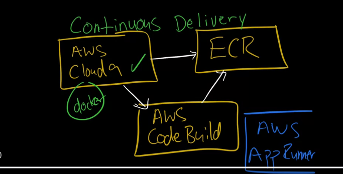
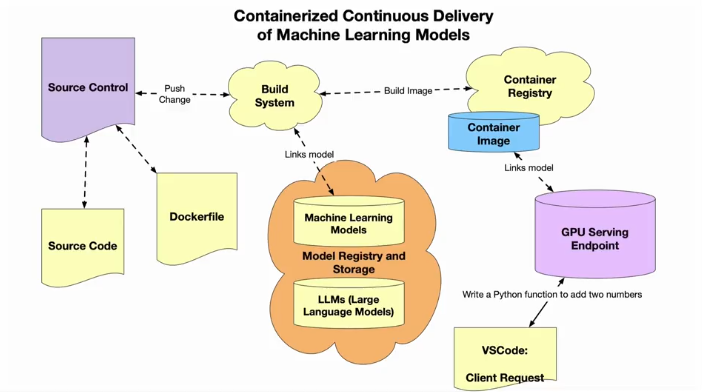
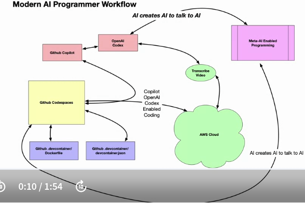
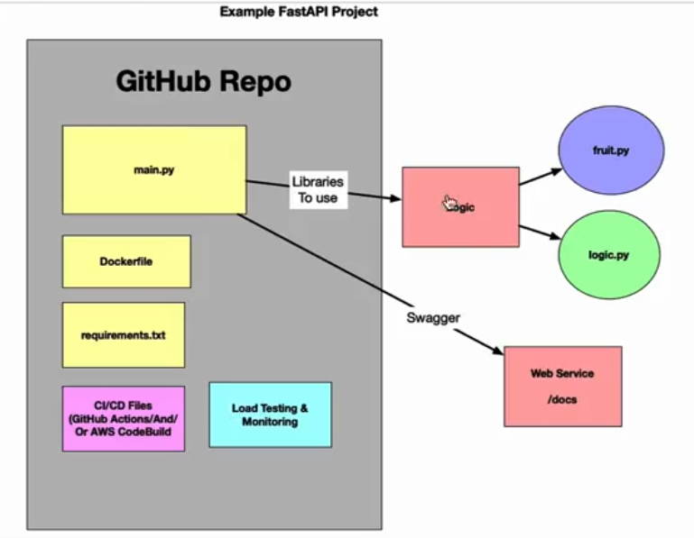
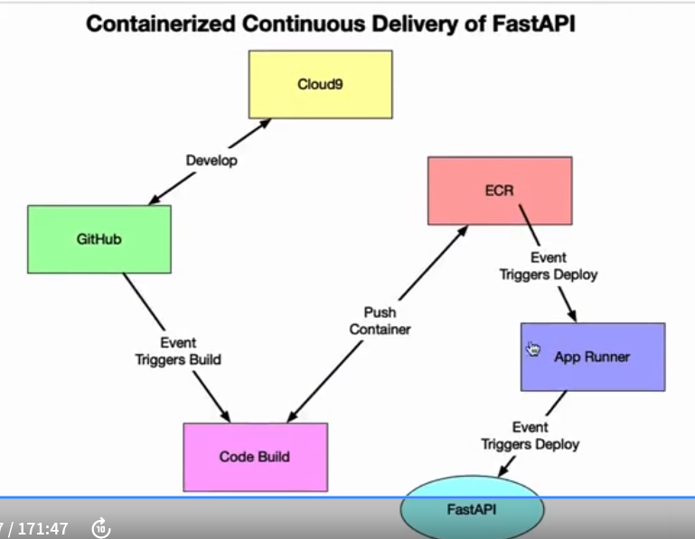

# containerised_microservice
containerise a micro service

## Key Terms
- <b>Container</b> - A standardized, lightweight software package that bundles together an application's code and dependencies to run reliably in any environment.

- <b>Container Registry</b> - A repository for storing, sharing and deploying container images, often integrated into CI/CD pipelines. Examples: Docker Hub, AWS ECR.

- <b>Container Orchestration</b> - Automated management, scaling and coordination of containers leveraging platforms like Kubernetes and Amazon ECS.

- <b>Continuous Delivery</b> - Software development practice to build, test and release containers quickly and reliably by automating deployments through CI/CD pipelines.

- <b>Infrastructure as Code</b> - Managing infrastructure like networking, compute, storage through machine-readable definition files rather than manual processes. Enables reproducibility.

- <b></b>Distroless Container</b> - Optimized container image containing only an app, run-time language, and essential system libraries, omitting shells, package managers, etc. Improves security.

## containerized microservice
- 

## Containerized Countious Delivery



## AWS Echosystem
- push code to ECR
    - create a new ECR
    - open the new ECR
    - commands are listed
        - authenticate
        - build the continer
        - tag
        - push

- App Runner
    - select the image and the tag (Latest)

- AWS code build
    - contious delivery (CI/CD pipeline for AWS)
    - change in the GitHub reflected in AWS ECR

## sample.py
- simple function to add 2 numbers
- FastAPI wrapped

## ML model Containerized
- Cloud9
    - clone the repo
    - push the image to ECR
    - commands will be given when create a new ECR to push the image
- ECR
    - ECR login
    - tag the image
    - push the image 
- AWS app runner
    - 

## Architecture
    - platforms
        - model
        - data
        - notebooks
    - model (containerize)-> ECR -> appRunner (Microservice)

- 

## Docker commands
- `docker build . -t <tag_name>`
- `docker image ls # list the docker ids`
- `docker run -p 127.0.0.1:8080:8080 <image_id> `
- to remove a docker image `docker rmi <image_id>`

## Dustiriless Containers
- small images size (docker image)
    - 36 MB compared to some 100s of MBs

## Additional Reading
|Title|Tye|Lenght<br>(minutes)|Brief Descrition|
|---|---|---|---|
|[Virtualization and Elasticity](https://paiml.com/docs/home/books/cloud-computing-for-data/chapter03-virtualization-containers-elasticity/)|Reading|15-30|A reading on virtualization and elasticity that provides a foundational overview of cloud computing concepts.|
|["Distroless" Container Images](https://github.com/GoogleContainerTools/distroless)|Documentation|10-15|The official GitHub Repo for distroless containers that reduce the size of container images.|
|[Example GitHub project with Rust distroless](https://github.com/alfredodeza/rust-distroless-azure)|Interactive Tutorial|10-15|A Rust example project that uses distroless container technology to deploy Rust to Azure.|
|[Creating a congare image for use on Amazon ECS](https://docs.aws.amazon.com/AmazonECS/latest/developerguide/create-container-image.html)|Reading|5-10|Documentation showing how to build and use container images on ECS.|
|[Azuere Functions with Rust](https://learn.microsoft.com/azure/azure-functions/create-first-function-vs-code-other?tabs=go%2Cmacos&WT.mc_id=academic-0000-alfredodeza)|Reading|5-10|An official Microsoft reading on how to use Azure Functions with Rust|
|[Introductiion to Containers](https://docs.google.com/presentation/d/1uBlq4CMeQSffU3wwyU0xRrSR7buud20t/edit#slide=id.p1)|Reading|15-30|AWS official powerpoint presentation discussing container technology.|

## Reflections
- <b>Summary</b> This lesson explained containers for encapsulating reusable, reliable ML applications, leveraging continuous delivery pipelines, Kubernetes orchestration, infrastructure as code, and optimized distroless images.

### Key Points
- Containers enable portable ML applications
- Automated pipelines deploy containers
- Orchestration cooridates scale

### Reflection Questions
- How could containers improve collaboration in an ML team?
- What dependencies should be included in a container image?
- What expertise is required to orchestrate containers?
- Why define infrastructure as code?
- What security risks do non-distroless containers introduce?

### Excercises
1. Containerize an ML model API with Docker
2. Set up a container registry to store images
3. Deploy a container to a Kubernetes cluster
4. Write Terraform configs to spin up container infrastructure
5. Compare size and security of distroless vs regular containers

# Placeholder

## Key Terms
- <b>AI Pair Programming</b> - Collaborative software development between a human and an AI assistant that suggests code interactively.
- <b>GitHub Copilot</b> - An AI programming tool from GitHub that provides context-aware code suggestions and entire functions in real-time as developers type.
- <b>Code Whisperer</b> - Amazon's intelligent coding assistant for suggest code snippets and documentation powered by CodeGuru and GPT-3. Still in preview.
- <b>OpenAI Codex</b> - AI system from OpenAI trained on code to translate natural language to code and suggest possibilities programmed by humans.
- <b>Responsible AI</b> - Developing and deploying AI that respects human rights and democratic values like transparency, privacy, non-discrimination and accountability.

## AI Programmer workflow
- 
- AI help programmer to code faster

## Python DevOps with Copilot
- Git repo
- Git code space
    - customization
        - machine selection
        - add extentions
            - Copilot
        - devcontainers.json
            - customization file
    - Files
        - Makefile
            - install
            - lint
            - format
            - deploy
            - all
        - requirements.txt
            - pinned requirements
    - virtual environment
        - `python -m venv .venv`
        - `source .venv/bin/activate`
        - `deactivate`
    - install ipython outside the requirements
        - not needed for deployment
    - ipdb for interactive debugging
        - `import ipdb; ipd.set_trace()`

## Countinous Integration
    - Git(code) --> Development envrionment
    - need a feedback loop, the code is working
    - github actions

## Project building steps
- create a lib (logic in library)
- wrap the function in a cli, if the cli is working
- create a web app

### Project diagram (FastAPI)


### Continerized Contious Delivery of FastAPI



### buildspec.yml
```
version: 0.2

phases:
    build:
        commnads:
            - make all
```
- AWS build system
    - to deploy changes in the git to app
    - poin to the buildsepc.yml